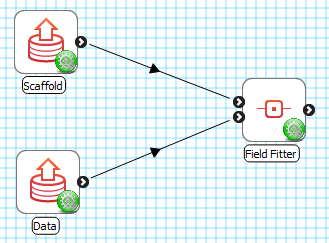
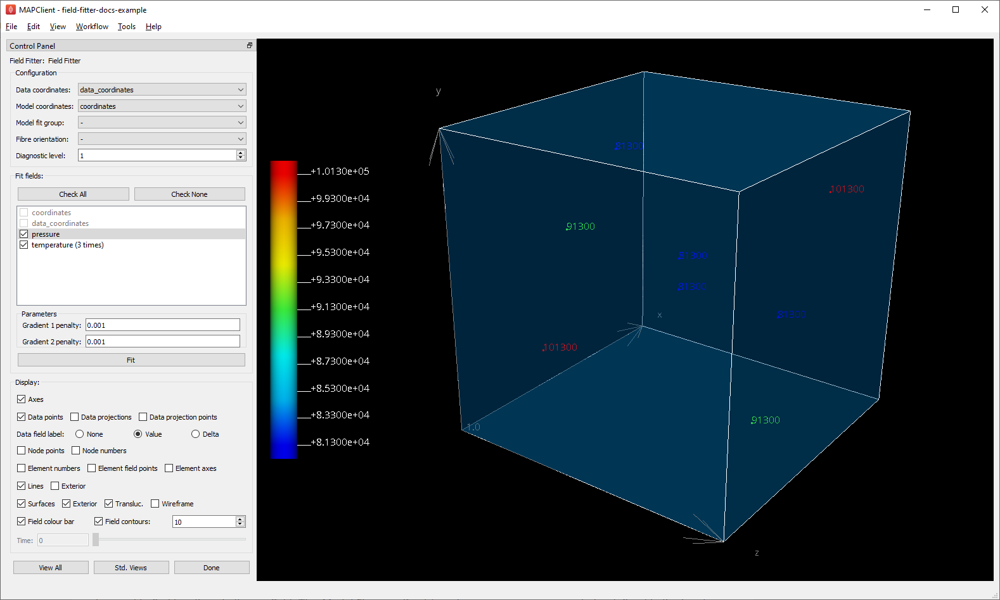
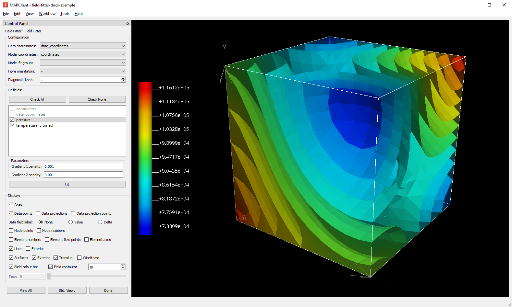
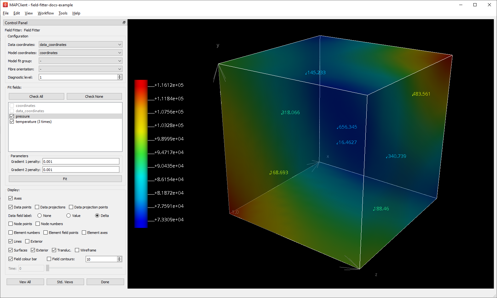
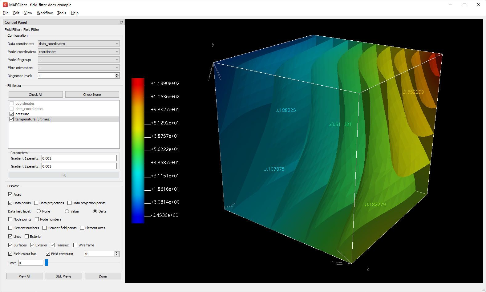
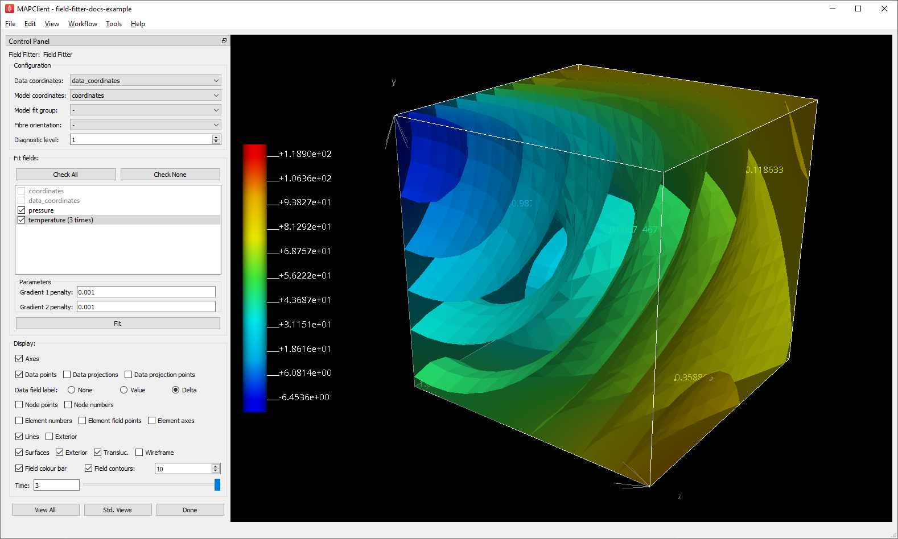

Field Fitter
============

Overview
--------

The **Field Fitter** tool is an interactive user interface for defining and fitting continuous fields over a scaffold, from discrete, non-geometric data, e.g. physiological measurements at points over the domain of the scaffold. It works with data points on which both the non-geometric and coordinate field values are defined, with the coordinates relative to a coordinate field on the input scaffold. The output fields are all defined with the same interpolation as the input scaffold's coordinate field.

The tool fits scalar and multi-component fields. It also fits time-varying field data, generating a continuous field defined over space and time.

This document describes how to set up and perform fitting with the **Field Fitter** user interface in the Mapping Tools. The fitting process is managed by the underlying *fieldfitter library* which can run it without a user interface, together with the *Zinc library* which handles model representation and computation.

Workflow Connections
--------------------

The workflow connections for **Field Fitter** are shown in Fig. 1:

.. _fig-field-fitter-workflow:

   **Field Fitter** workflow connections.

The tool uses 2 inputs on the left, both *Zinc library* compatible EX files:

1. The scaffold to define the continuous field over, containing the definition of the [usually fitted] coordinate field in the same configuration as the data, output from **Geometry Fitter**, **File Chooser** if read from a file, or **Scaffold Creator** if data is supplied relative to one of its standard coordinate fields (top input);
2. The field data to fit, consisting of data points with coordinates relative to a coordinate field on the scaffold and additional real field values to fit continuous fields to (bottom input). 

It produces 1 output, also a Zinc EX file, which may be piped to other workflow steps:

1. The fitted non-geometric fields defined on the scaffold or chosen subset of it.

The output fitted fields share the same name as the input data fields.

Whether you use the output in a further workflow step or not, on completion of the workflow step the output is written to a file in the workflow folder under the same name as the step with extension ".exf".

Background
----------

Each field being fit is first defined over the whole scaffold (or a chosen subset of it) using the same parameter mapping and interpolation as the first component of the coordinate field chosen on the scaffold. At that point all its parameters are zero.

For each data point, its location in the scaffold mesh is calculated by finding the mesh location which has coordinates equal to the data point coordinates, or the nearest point in scaffold coordinates if the data points are outside its range. 

.. note::

   Allowing data to be linked to the nearest point on the scaffold is only intended to support data just outside the scaffold; data which is too distant is likely to produce meaningless results.

A least-squares optimisation is then performed to compute the continuous field parameters giving the minimum sum of the square of the difference between the continuous field value at the data points' mesh locations, and their data field parameters (for each component if multi-component).

If there are sufficient measured data point values over all elements of the scaffold, this will produce a good fit. If data is sparse such that there are fewer data values than the number of field parameters being fitted, either globally or locally, either no valid solution will be found, or it will contain wild and unreasonable fluctuations in value over the domain. Even when there is a sufficient number of data points, random variation in their measured values can lead to similar unreasonable fluctuations in the fitted continuous field.

For these cases the user interface allows penalties to be applied to the gradient of the field with respect to coordinates, and its second gradient (gradient of gradient). The user enters small penalty coefficients for each of these terms so that the data point differences are hardly affected, but the spurious fluctations in the field are minimised. Increasing values for the first gradient penalty tends to make the solution approach the mean of the input data field values. Increasing values for the second gradient penalty tends to limit high rates of change of the field i.e. the wild fluctuations in the fitted field. The overall effect is to *smooth* the fitted solution.

.. note::

   Second gradient smoothing only works on fields interpolated with quadratic, cubic and other higher-order functions, and is best suited for use with cubic Hermite interpolation which maintains derivative continuity between elements.

Time-varying fields are fitted by performing a spatial fit at all input parameter times, which defines a time sequence of parameters for the resulting continuous field.

.. note::

   Fitting fields over large (many-element) scaffolds, or for large numbers of times, can be slow.

Instructions
------------

To illustrate field fitting we will use an `example workflow <https://github.com/mapclient-workflows/field-fitter-docs-example>`_ (`download zip <https://github.com/mapclient-workflows/field-fitter-docs-example/archive/refs/heads/main.zip>`_) which has made-up data to be fitted over a unit cube interpolated with tricubic basis functions.

Running the example workflow opens the **Field Fitter** user interface shown in :numref:`fig-field-fitter-interface`.

.. _fig-field-fitter-interface:

   Field Fitter interface before fitting.

When first run, **Field Fitter** discovers an initial configuration (top box in the *Control Panel*), but the user may edit these parameters, and any changes made here and elsewhere in the interface are kept for next time (but only after *Done* is clicked -- see later). The *Data coordinates* is the field giving coordinates on the data points, while the *Model coordinates* is the field giving coordinates on the scaffold; both coordinates are expected to be in the same configuration so the data coordinates can be used to find locations in the scaffold. The *Model fit group*, if set (requires one or more groups to be defined in the input scaffold) limits fields to being defined on that group only; default value ``-`` fits over the entire scaffold. The *Fibre orientation* field, in particular its use for fitting over 2-D meshes, is discussed in :ref:`field-fitter-advanced-features`. Setting a *Diagnostic level* above zero causes diagnostic information to be written to the console during the fit, including fitting objective values to see how the fit minimises data difference and gradient penalty objectives.

The *Fit field* section lists the fields which are to be fit, along with penalty factor edit boxes and the *Fit* button. When initially run no fields are checked, but this example is already configured to fit two fields. Users must check the fields they wish to fit, but this does not cause them to be fitted yet. The coordinate fields in use are listed but not checkable. The *Check All* button checks all eligible fields, while *Check None* unchecks all fields. Note that the ``temperature`` field is listed as being time-varying with parameters at 3 times; this is discussed later.

Under the field list are boxes for entering the penalty factors to apply to penalise first and second gradients of the field with respect to model coordinates. Choosing these penalty values takes experience, and some trial-and-error. The required penalty values will vary depending on the units/scale of the data, the number of data points, and how solid or hollow the scaffold is. (At some point these will be "non-dimensionalized" to remove most of the effects of data scale, but this has not yet been done.) For now, you need to do a parameter search to find values that have the desired effect: starting at 1.0, go up or down by 2 orders of magnitude (100x if going up, 0.01x if going down) until the behaviour is close to what you want, then fine tune. Note that there is currently only one set of penalty factors applied to all fields, but this may be generalised in future. In this example small values work fine for ``pressure`` and ``temperature`` despite their values being different by 3 orders of magnitude.

The following description assumes the user wants to do some interactive fitting, change penalty factors and visualize the fields; otherwise proceed to clicking *Done* as described at the end of this section.

At any time (apart from when calculations are being performed) you may turn on or off separate graphics in the Display box, or transform the view in the window using mouse button dragging (along with Crtl/Alt on Mac) to rotate, translate and zoom. The *View All* button restores a standard perspective view of all the graphics, while the *Std. Views* button cycles standard orthographic views. Some of the graphics such as *Contours* are only shown once the field is fitted, and several graphics are changed to be coloured by fitted field values.

Clicking on a field in the lists selects it. The data points and field values for the selected field are shown in the graphics, provided display setting *Data field label* is set to *Value*, with a spectrum and colour bar automatically showing the range of values present in the data.

Select the ``pressure`` field and click on the *Fit* button to fit the field, which takes an instant for this example. The result is shown in :numref:`fig-field-fitter-fitted-pressure`. The *Surfaces* can be made non-translucent to more clearly see the field on the surfaces of the model; the *Field contours* visualize the field throughout the volume (with a controllable number of contours throughout the range), and *Element field points* alternatively shows the field at evenly sampled points throughout the volume. When the field is fitted, the spectrum range as shown on the colour bar is expanded to include the range of the fitted field.

.. _fig-field-fitter-fitted-pressure:

   **Field Fitter** showing fitted pressure contours.

Hiding the *Field contours* and changing *Data field label* to *Delta* shows the difference between the data point and fitted field values at each data point as in :numref:`fig-field-fitter-fitted-pressure-delta`, which gives a measure of fitting error. *Delta* values should be significantly lower than the magnitudes of the field values themselves.

.. _fig-field-fitter-fitted-pressure-delta:

   **Field Fitter** showing fitted pressure data point *Delta* error measure.

.. note::

   Zero *Delta* values are seldom possible because (1) with large numbers of data points an exact fit is limited to the resolution of the mesh combined with the form of the basis functions, and (2) using non-zero and higher gradient penalty values increases *Delta* values as the overall numerical objective is now a compromise between reducing data point differences and the weighted gradient integral.

Changing any of the penalty factors or unchecking the field clears the fit. Enter 0.0 for both *Gradient 1/2 penalty* values and re-fit the ``pressure`` field. You will see the *Delta* values are negligible, however the *Field contours* are significantly different as the solution is now ill-defined away from the data points.

Re-enter *Gradient 1/2 penalty* values ``0.001`` before proceeding.

Select the ``temperature`` field and fit it. The result is shown in :numref:`fig-field-fitter-fitted-temperature-time-0`. This field is time-varying with 3 values supplied at times 0.0, 1.0 and 3.0 for each data point, so a spatial field fit is performed at each of these times to make a time-varying field over the scaffold. The range of the spectrum and colour bar is automatically enlarged to include the range of fitted field values at all times.

.. _fig-field-fitter-fitted-temperature-time-0:

   **Field Fitter** showing fitted temperature at time 0.0.

The *Time* slider can be used to interactively visualize the field at times in the range [0.0, 3.0], or particular values can be entered in the edit box. Field values at in-between times are linearly interpolated from values fitted at the stored times. :numref:`fig-field-fitter-fitted-temperature-time-3` shows the ``temperature`` at time 3.0.

.. _fig-field-fitter-fitted-temperature-time-3:

   **Field Fitter** showing fitted temperature at time 3.0.

Click *Done* to save all current settings, fit all remaining checked fields (which can take some time) and progress to the next workflow step.
 
.. _field-fitter-advanced-features:

Advanced Features
-----------------

The **Field Fitter** has some features which may help fitting in certain cases:

1. Gradient penalties can be multi-component to give different penalties in directions 1, 2 and 3 (which coincide with global x, y and z directions when no *Fibre orientation* field is in use - see below). These are entered as comma-separated values. The number of values used depends on the dimension of the scaffold's mesh: if there are fewer values than the number expected, the last value is used for all remaining factors (which is how a single value works), so you'll usually need to set either one or all values. For fitting on lower dimensional meshes where the coordinate field has more components than the mesh dimension, a *Fibre orientation* field must be set to apply gradient penalties in directions in-plane or in-line with the mesh. The same penalties are applied to each component of the field, if multi-component:
    * Up to 3 values can be set for the *Gradient 1 penalty* for 3-D meshes, which penalize gradients in the 1, 2 and 3 directions. 2 values are used for 2-D meshes and 1 value for 1-D meshes.
    * Up to 9 values can be set for the *Gradient 2 penalty* for 3-D meshes. These scale 9 second derivatives which are indexed by the coordinate components twice, a symmetric matrix meaning the penalties are also expected to be symmetric with only 6 independent values for 3-D meshes, e.g. ``A, B, C, B, D, E, C, E, F``, where ``A``, ``D`` and ``F`` are real values scaling the 'curvature' derivatives in the 1-1, 2-2 and 3-3 directions, while ``B``, ``C`` and ``E`` are real values scaling the 'shear' derivatives in the 1-2, 1-3 and 2-3 directions. Higher values give a greater penalty, which reduces these derivatives in the solution. For 2-D meshes the penalty values are ``A, B, B, D``, and for 1-D only ``A``.
2. If a *Fibre orientation* field is specified in the *Configuration*, the gradients to penalise are measured with respect to local fibre directions in each element. At this time only the in-built ``zero fibres`` field is practical for use (otherwise choose ``-`` to disable). This reorients the reference coordinates for the gradient to a local coordinate system where the first direction is in line with the local element axis 1 (show *Element axes* graphics to see), the second direction is normal to this in the 1-2 plane of the element axes, and the third direction is normal to both of these. Uses include:
    * For scaffolds where the third element axis is through the wall of a hollow structure, multi-component deformation penalties can be applied separately in-plane (directions 1 and 2) and through the wall (direction 3). For example, a high penalty through the wall will make the field near-constant in that direction. Likewise, increasing penalties on the 1-3 and 2-3 planes reduces out-of-plane 'shear' effects in the fit.
    * When fitting fields on a 2-D or 1-D mesh with 3-component coordinate fields, a *Fibre orientation* field **must** be set in order to use deformation penalties. This is because the gradients must be transformed to be with respect to in-plane directions.
